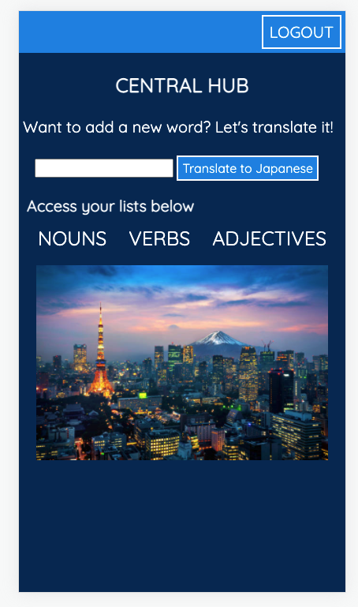

# My Japanese Library

### Link to live site: [日本後の図書館](https://my-japanese-library.herokuapp.com/)

- Technologies:
    - Javascript
    - MongoDB with Mongoose
    - Express - Node.js
    - EJS
    - AJAX with DeepL Translation
    - jQuery
    - CSS
    - HTML

Application that allows a user to signup and login to create their own Japanese word library. 
Currently, user has full CRUD functionality for nouns, verbs, and adjectives.  
User can use a translation API call on the central hub page. 
    - Free API not great with exact translations. Translates a lot of words into katakana while there should be a hiragana or kanji version.  
Future Enhancements 
    - Favicon 
    - Show page will have a special symbol displayed if word is marked as memorized. 
    - Have the word read aloud from computer speaker as soon as show page loads. 